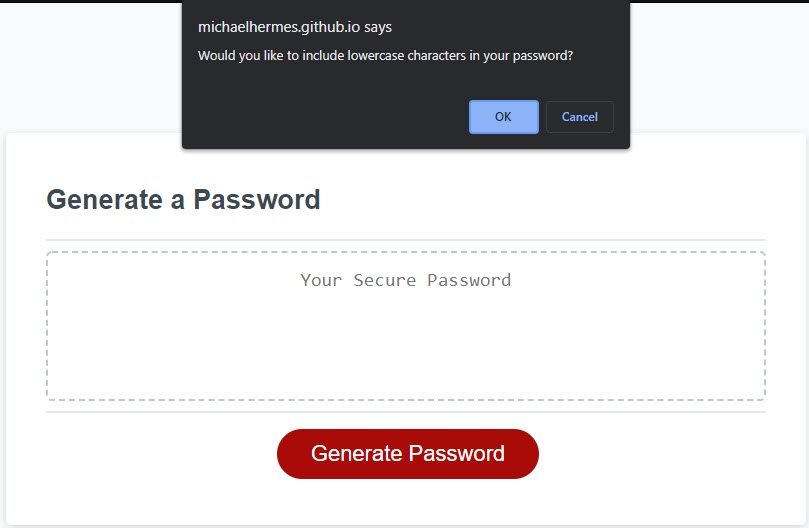

 # password-generator
 ## Description
This application provides a mechanism for a user to generate a random password. The user is given the option to customize their password criteria, including length and characters to include in the password.
## Usage
[Password Generator](https://michaelhermes.github.io/password-generator/)

To begin, the user clicks the "Generate Password" button. They are presented with several prompts, asking them to customize how they would like their password to be generated. The user is required to choose a password length between 8-128 characters.

Additionally, they must include at least one of the following password criteria:
 - Lowercase
 - Uppercase
 - Numeric
 - Special

Once all input has been successfully gathered from the user, a random password will be generated and written out to the screen.

